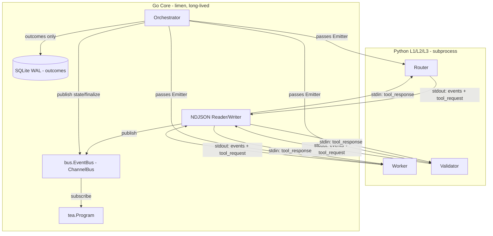

# Limen Interactive TUI Design

This document specifies the interactive terminal user interface for Limen: a long-lived, observe-only view that surfaces the live activity of the Router (L1), Worker (L2), and Validator (L3) as a task moves through the orchestration state machine.

## Goal

The user must be able to see, in real time:

- what the Router is examining and what it decides,
- what the Validator is checking and its per-criterion verdicts,
- what the Worker is doing inside the codebase (tool calls and file edits), and
- the full state-machine timeline of the task.

The interface must be clean, minimal, and structured as multiple switchable views.

## Entry Point

The bare invocation lands in the TUI by default:

```
$ limen
```

This is the primary, simple call. The one-shot scripting surface is preserved as an explicit subcommand:

```
$ limen run-task --task-id <id> [...]
```

Rationale: the interactive mode is the expected human-facing entry point; forcing users to type a subcommand for the primary experience adds friction with no benefit. The one-shot `run-task` remains for automation, CI, and pipes.

## Locked Decisions

| # | Decision | Choice |
|---|---|---|
| 1 | Process model | Long-lived `limen` (bare) runs the orchestrator in-process; Python L1/L2/L3 are spawned as subprocesses. `run-task` stays one-shot for scripting. |
| 2 | Event transport | In-process Go channel behind a `bus.EventBus` interface. A Redis-backed implementation can slot in for v2 distributed work without touching producers or consumers. |
| 3 | Interaction scope | Observe-only for v1. The library choice keeps the control path open for v2. |
| 4 | Interface widening | Explicit `Emitter` parameter added to Router/Retriever/Worker/Validator methods. |
| 5 | Event richness | Structured reasoning traces (full event taxonomy). |
| 6 | Worker activity source | Python streams structured edit events over stdout NDJSON. |
| 7 | Protocol | Bidirectional NDJSON RPC for interactive mode; Go services tool calls in-process. |
| 8 | View model | Switchable tabs: Router / Worker / Validator / Timeline. |
| 9 | Persistent header | Slim status line always on top (state node + task ID + retry/expand counts + spinner). |
| 10 | Completion behavior | Stay open for review; auto-switch to Timeline; `q` to quit. |
| 11 | TUI library | Charmbracelet Bubble Tea + lipgloss + bubbles. |
| 12 | Persistence | Fine-grained events are ephemeral for v1; outcomes remain in SQLite. Documented exception. |

## Architecture



### Tool Call Flow (Interactive Mode)

In interactive mode, the README's "Python invokes Go as subprocess" model is inverted: Go is the long-lived parent and Python are the children. Tool calls flow as bidirectional NDJSON RPC over the subprocess pipes:

1. Python emits a `tool_request` envelope on stdout.
2. Go's NDJSON reader dispatches it to the in-process handler (the Go Core already owns state and git).
3. Go writes the `tool_response` envelope on Python's stdin.

This replaces the subprocess-reinvocation model for interactive mode only. `run-task` preserves the legacy one-shot semantics for scripting. The README and `determinism_boundary.md` require a note documenting this interactive-mode inversion.

## Event Bus

Location: `internal/bus/bus.go`.

```go
type Event interface{ kind() string }

type EventBus interface {
    Publish(Event)
    Subscribe() <-chan Event
    Close()
}
```

- `ChannelBus`: buffered Go channel implementation.
- **Backpressure policy**: a fixed large buffer (1024) with **blocking publish**. No events are dropped while the bus is open. Losing an edit event would corrupt the "see what workers do" guarantee. In single-task v1 the TUI consumes far faster than producers, so the block is effectively never hit. This must be revisited for multi-task v2.
- **v2 seam**: `RedisBus` implements the same `EventBus` interface; zero producer or consumer churn when introduced.

## Interface Widening

Location: `internal/orchestrator/orchestrator.go`.

An `Emitter` (alias for a narrow `bus.EventSink` interface) is added as an explicit parameter to each cognitive-component method:

```go
Router.Evaluate(ctx, task, em Emitter) (RouterDecision, error)
Retriever.Retrieve(ctx, task, em Emitter) (string, error)
Worker.ProduceSolution(ctx, task, wt, feedback, em Emitter) error
Validator.Evaluate(ctx, task, wt, em Emitter) (bool, string, error)
```

The orchestrator itself emits `TaskStateChanged` around each `TransitionState`, `ConflictDetected` on conflict, and `TaskFinalized` at terminal states. Existing tests migrate to a recorder emitter for assertions.

Rationale for explicit parameter over `context.Context` carriage: visibility in signatures, ease of mocking with a recorder, and no hidden coupling. The migration cost is straightforward.

## Event Taxonomy

Every event carries a `TaskID` and a `Timestamp` so the TUI can route and order events unambiguously, even if the bus later supports multiple tasks.

| Event | Emitter | Tab |
|---|---|---|
| `TaskStateChanged{taskID, from, to, ts}` | orchestrator | Timeline |
| `ContextBuilt{taskID, snapshotSize, manifestRef, ts}` | retriever | Router |
| `RouterExamining{taskID, contextExcerpt, entropy, ts}` | router | Router |
| `RouterDecisionEvent{taskID, decision, rationale, expandCount, ts}` | router | Router |
| `WorkerStarted{taskID, worktreePath, baseCommit, retry, ts}` | worker | Worker |
| `WorkerToolCall{taskID, tool, args, ts}` | worker | Worker |
| `WorkerFileEdit{taskID, path, op, diffHunk, ts}` | worker (via Python NDJSON) | Worker |
| `WorkerFinished{taskID, ts}` | worker | Worker |
| `ValidatorExamining{taskID, criteria, ts}` | validator | Validator |
| `ValidatorCriterionResult{taskID, criterion, passed, detail, ts}` | validator | Validator |
| `ValidatorVerdict{taskID, passes, feedback, ts}` | validator | Validator |
| `ConflictDetected{taskID, regions, ts}` | orchestrator/git | Worker |
| `TaskFinalized{taskID, finalState, finalOutputRef, ts}` | orchestrator | Timeline |
| `OrchestratorError{taskID, error, ts}` | orchestrator | Timeline |

NOTE: The `RouterDecision` event type is named `RouterDecisionEvent` in `internal/bus` to avoid a type-collision with the mirrored `RouterDecision` string type. Its `kind()` string remains `"RouterDecision"`.

## TUI Layout

Library: Charmbracelet Bubble Tea + lipgloss + bubbles.

```
+----------------------------------------------------------+
| limen | task test-alpha-1 | WORKER_RUNNING | r:1 e:0 |*|  |  <- slim persistent status line
+----------------------------------------------------------+
| [1:Router]  2:Worker  3:Validator  4:Timeline            |  <- tab strip
+----------------------------------------------------------+
| ...active tab content rendered in a scrollable viewport...|
+----------------------------------------------------------+
```

### Tabs

- **Router**: context excerpt + entropy score + decision + rationale + expand count.
- **Worker**: worktree path and base commit + tool-call stream + file-edit stream (path, op, diff hunk) + conflict regions.
- **Validator**: criteria list + per-criterion results + verdict + feedback.
- **Timeline**: ordered sequence of all events, mirrors SQLite `state_transitions` and `tool_calls`, current node highlighted.

### Keybindings

- `1`-`4` / `[` `]`: switch tabs.
- `j`/`k` or arrow keys: scroll the active viewport.
- `q` / `Ctrl+C`: quit.
- `?`: help overlay.

### Completion Behavior

On `TaskFinalized`, the TUI stops the event pump, auto-switches to Timeline, and shows the final state plus the `FinalOutput` diff in a footer. The bus drains and closes; no new events arrive. The user inspects the result and quits with `q`.

### TTY Fallback

If stdout is not a TTY, the Bubble Tea render is skipped and events are emitted as log-style lines (reusing `run-task` output style). This keeps pipes, CI, and non-interactive shells functional.

### Threading Contract

The Python stdout reader and the orchestrator goroutine publish events to the bus. The TUI pumps events into `tea.Msg` values via a `tea.Cmd`; model state is never touched from a raw goroutine.

## Persistence Exception (v1)

The `determinism_boundary.md` §1 contract states that retrieved context and tool arguments must be reproducible. The new fine-grained streams (router reasoning traces, worker edit events, validator per-criterion results) are **not persisted in v1**; they are ephemeral, live in the TUI only, and are lost when the TUI closes.

This is a deliberate, documented exception scoped to "while L1/L2/L3 are placeholders." It must be tracked with a `TODO`. The SQLite `events(task_id, seq, type, json, ts)` table lands together with the real Python clients. The existing outcome tables (`state_transitions`, `validation_decisions`, `tool_calls`, `final_output`, `context_snapshot`) remain in SQLite as today.

## v1 De-risking Move

The Python L1/L2/L3 clients are still TODO stubs. The TUI ships against the existing Go stub components by having them emit synthetic events. This produces a fully functional end-to-end TUI before Python exists. The NDJSON envelope is defined now so Python implements against it later.

## Build Order

1. `internal/bus` package: event types + `ChannelBus` + recorder-emitter tests.
2. Widen orchestrator interfaces; orchestrator emits state and finalize events; migrate tests to recorder emitter.
3. `limen` (bare) TUI shell: status header + four tabs rendering from the channel, against synthetic stub events.
4. NDJSON envelope + bidirectional RPC prototype. This is the riskiest new surface; prove one `tool_request`/`tool_response` round-trip first.
5. Real Python clients emit the taxonomy; swap stubs out. Land the SQLite `events` table at this point.

## Files

- **New**: `internal/bus/bus.go` (interface, `ChannelBus`, event types); `internal/tui/` (model, header, `tabs/router`, `tabs/worker`, `tabs/validator`, `tabs/timeline`).
- **Changed**: `cmd/limen/main.go` (bare `limen` dispatches to TUI; synthetic-emitting stubs); `internal/orchestrator/orchestrator.go` (widen interfaces, emit events); tests.
- **Docs**: README diagram and `determinism_boundary.md` note for the v1 ephemeral-events exception and the interactive-mode tool-call inversion.

## v2 Considerations (Out of Scope for v1)

- **Human-in-the-loop control**: pause at `AWAITING_VALIDATION` / router `ESCALATE`; approve, reject, inject feedback. Requires input handling, modals, and a control channel back into the orchestrator.
- **Distributed event transport**: `RedisBus` implementing `EventBus` for multi-observer or daemon modes.
- **Multi-task dashboard**: the slim status line and tab model scale to a task list, but the v1 single-task focus is preserved to validate the event plumbing first.
- **Full control console**: pause/resume, retry, abort, spawn sub-tasks.
