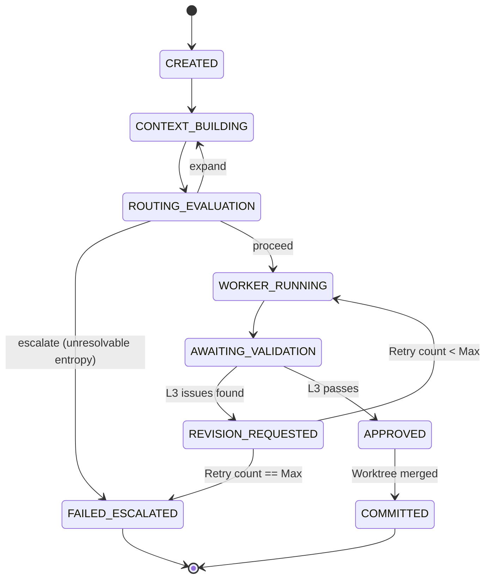

# Limen Task State Machine & Invariants

This document outlines the strict lifecycle states for tasks within the Limen orchestration engine. 

The Go Core is the exclusive owner of this state.

## State Graph

## State Definitions

- **`CREATED`**: The task is initialized in the SQLite DB. No processing has begun.
- **`CONTEXT_BUILDING`**: Progressive retrieval is active (BM25 → Semantic). Context is being gathered but not yet finalized.
- **`ROUTING_EVALUATION`**: The router analyzes context entropy and confidence. It decides whether to `proceed` to execution, loop back to `expand` the context, or `escalate` immediately if the context is fundamentally unresolvable.
- **`WORKER_RUNNING`**: The L2 Worker model is actively generating or editing code within an isolated `git worktree`.
- **`AWAITING_VALIDATION`**: The worker has completed its output. The system pauses the worker and hands the artifacts over to the L3 Validator.
- **`REVISION_REQUESTED`**: The L3 Validator identified flaws in the artifacts. The retry counter is incremented, and the task loops back to `WORKER_RUNNING` with the validator's feedback.
- **`FAILED_ESCALATED`**: Terminal failure. Triggered either by exhausting the maximum allowed retry loops (e.g., >5 for hard tasks) or by the router facing unresolvable entropy. The system halts and requests human intervention.
- **`APPROVED`**: The L3 Validator has verified the correctness of the artifacts.
- **`COMMITTED`**: The isolated `git worktree` is merged into the canonical branch, and the worktree is destroyed. The task is fully complete.

## Invariants

1. **State Ownership**: Only the Go Core can initiate a state transition. Python MCP clients can only request actions.
2. **Strict Linearity of Validation**: A task cannot move to `COMMITTED` without passing through `APPROVED`.
3. **No Infinite Loops**: The transition from `REVISION_REQUESTED` to `WORKER_RUNNING` is strictly gated by the max retry limit.
4. **Router Precedence**: The worker cannot run until `ROUTING_EVALUATION` yields a explicit `proceed` decision.

## Orchestration Pipeline (Go Core Main Loop)

The Go Core enforces the Separation of Powers axiom by executing this strict procedural sequence:

1. **Is Git state valid?**
   └─ `no` → fix physical layer (conflict resolution)
2. **Build retrieval context** (ephemeral)
3. **Worker produces candidate solution**
4. **Validator evaluates correctness**
5. **If validator fails** → retry loop (semantic revision)
6. **If Git conflict** → semantic resolution step (re-apply, re-validate)
7. **If both Git and Validator agree** → commit via Go Core
