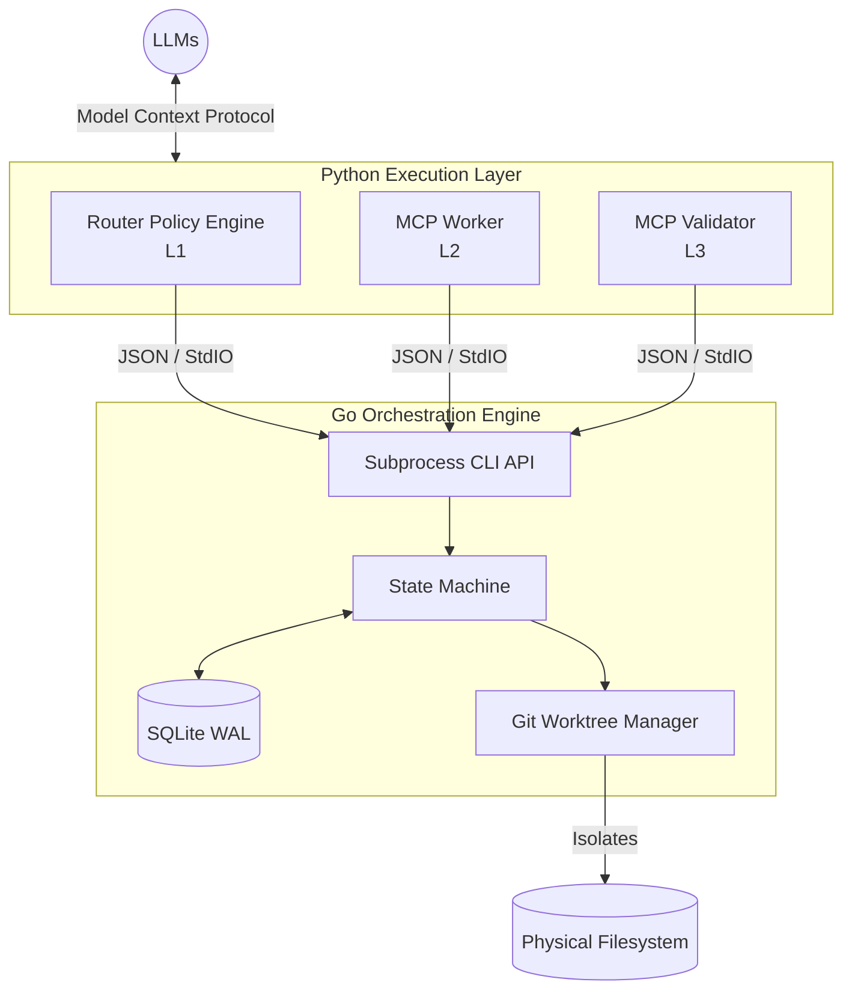

# Limen

**Limen is fundamentally a correctness-oriented workflow engine that uses LLMs as interchangeable cognitive workers.**

Limen sits between user requests and model backends, orchestrating complex, multi-agent software engineering workflows. It is not an agent framework, a distributed inference platform, or a message broker. It is a strictly controlled state machine designed to enforce code correctness before applying changes.

---

## Separation of Powers

The architecture is governed by a singular axiom:

> **Git defines feasibility, Go Core defines correctness, retrieval defines perception.**

If this separation is maintained strictly, the system stays decomposable. If any layer starts influencing another directly, the system falls into: _indistinguishable sources of truth → irreproducible behavior → impossible debugging._

---

## Core Architecture



The system has pivoted from a pure-Python execution loop to a highly resilient hybrid architecture:

### 1. Go Core (State Owner)

The orchestration engine is written in Go. It is the exclusive owner of the system's state, using an **SQLite WAL (Write-Ahead Logging)** database to ensure state durability and replayability.

- **Git Worktree Virtualization**: The Go Core provisions isolated `git worktree` environments for every task, allowing LLM workers to operate concurrently without creating dirty git histories.
- **Orchestration Loop**: The Core sequentially gates tasks through a strict state machine (`CREATED` → `ROUTING_EVALUATION` → `WORKER_RUNNING` → `AWAITING_VALIDATION` → `APPROVED` → `COMMITTED`).

### 2. Thin Clients (Execution Layer)

The Python layer has no stateful responsibilities. It consists solely of **stateless Model Context Protocol (MCP)** adapters and the heuristic routing engine.

- **Router (L1)**: Evaluates context entropy and complexity to decide whether to proceed, expand context, or escalate to a human.
- **Workers (L2)**: Connect to LLMs to generate code inside isolated worktrees.
- **Validators (L3)**: Evaluate the worker's artifacts against the original request.

When an LLM invokes an MCP tool, the Python adapter simply formats the request and spawns the Go Core as a CLI subprocess to manipulate the canonical state.

---

## The Main Loop

The Go Core ensures absolute correctness by executing this procedural pipeline for every task:

1. **Is Git state valid?**

   └─ `no` → initiate semantic conflict resolution

2. **Build retrieval context** (ephemeral manifest)
3. **Worker produces candidate solution** (inside isolated worktree)
4. **Validator evaluates correctness**
5. **If validator fails** → trigger retry loop
6. **If Git conflict on merge** → semantic resolution step
7. **If both Git and Validator agree** → squash merge and commit via Go Core

---

## Development Status

Limen has completed its core orchestration layer. The Go Core state machine, SQLite deterministic history tracking, and the Git Worktree virtualization engine are fully implemented and robustly tested. 

- [x] Formalized all capability constraints, invariants, and boundaries
- [x] Implemented the Go SQLite WAL state machine
- [x] Implemented the Go Git Worktree virtualization engine
- [x] Built the core `limen` subprocess CLI 
- [ ] Implement the Python MCP stateless clients and routing heuristics

---

## Testing Locally

The Go orchestration engine is functional and can be tested using the built CLI. While the actual LLM `Worker` and `Validator` clients are currently stubbed in the CLI facade, running a task will trace a complete "happy path" through the strict orchestration pipeline.

**1. Build the CLI binary:**
```bash
go build -o bin/limen ./cmd/limen
```

**2. Run a task:**
```bash
./bin/limen run-task --task-id "test-alpha-1"
```

**3. Inspect the deterministic history:**
The orchestration state is securely written to a local SQLite database (`limen.db`).
```bash
sqlite3 limen.db
```
```sql
-- See the task's final state
SELECT id, current_state FROM tasks WHERE id = 'test-alpha-1';

-- Inspect the immutable timeline of state transitions
SELECT * FROM state_transitions WHERE task_id = 'test-alpha-1' ORDER BY recorded_at ASC;

-- Inspect the tool invocations
SELECT * FROM tool_calls WHERE task_id = 'test-alpha-1';
```
