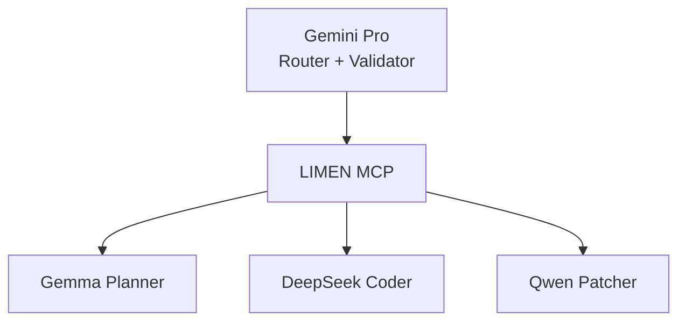
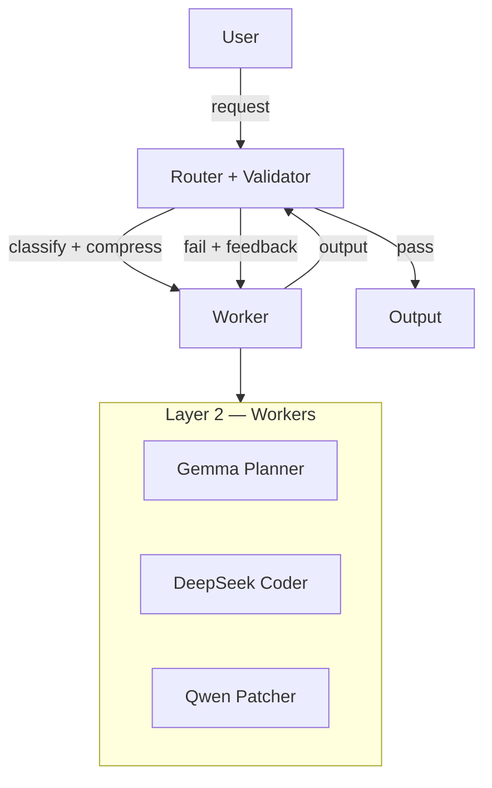

# Limen

Limen is a model-agnostic multi-agent orchestration system that sits between user requests and model backends. It connects multiple models through structured routing and validation using MCP as the execution layer.

- Fast models generate and transform
- Specialized workers execute domain tasks
- A strong validator enforces correctness
- A router compresses and assigns work deterministically

**Correctness is the primary architectural driver** — every design decision (tiered validation, router compression, L3-as-gate) serves this goal.

**Architecture is model-agnostic.** The layers are defined by role, not by provider. Any model can fill any layer. The stack below is my personal configuration for development:

---

## Model Stack (Personal Configuration)



Execution environments: [Antigravity](https://github.com/google-antigravity/antigravity-cli) (primary) + [Opencode](https://opencode.ai) (secondary).

---

## Core Architecture

### Layer 1 — Router

Classifies tasks by **type** and **complexity**, compresses user prompts, extracts relevant codebase context, and emits a structured execution plan.

### Layer 2 — Workers

Specialized models, one per execution role:

| Model          | Role                   | Task Types                               |
| -------------- | ---------------------- | ---------------------------------------- |
| Gemma Planner  | Architect & Researcher | architecture, document_writing, research |
| DeepSeek Coder | Code Generator         | code_writing                             |
| Qwen Patcher   | Debugger & Fixer       | debugging                                |

Workers produce initial outputs for validation or final use.

### Layer 3 — Validator

In this configuration, the same model routes and validates. Provides tiered scrutiny:

- **easy** — no validation
- **normal** — spot-check with limited retry (L3 returns issues; L2 revises)
- **hard** — full structured review loop: L3 produces issues with severity (critical/major/minor) and suggested fixes; L2 iterates until convergence or retry cap

For `code_writing` at hard complexity, L3 also **decomposes** the task into subproblems, dispatches each to L2 sub-agents, validates individual results, merges them, and performs a final correctness check.

---

## Routing Matrix

| Task             | easy    | normal  | hard                                  |
| ---------------- | ------- | ------- | ------------------------------------- |
| code_writing     | L2      | L2 → L3 | L3 (decompose → subagents → validate) |
| debugging        | L2      | L2 → L3 | L3                                    |
| architecture     | L2 → L3 | L3      | L3                                    |
| document_writing | L2      | L2 → L3 | L2 → L3                               |
| research         | L2 → L3 | L2 → L3 | L3                                    |

---

## Key Design Principles

- **Correctness over speed** — validation is the primary constraint. Fast outputs only matter if they pass L3.
- **Separation of concerns** — Router decides, Workers execute, Validator judges.
- **Model specialization** — workers are domain-tuned, not interchangeable.
- **Structured communication** — all inter-agent data is structured, not free-form chat.

---

## MCP Integration

Limen uses [Model Context Protocol](https://modelcontextprotocol.io/) as its execution layer — tool invocation, file system access, code execution, model calls, and validation all flow through MCP.

The architecture is execution-environment-agnostic. For personal development, I use:

- [Antigravity](https://github.com/google-antigravity/antigravity-cli) — primary MCP client for validator execution
- [Opencode](https://opencode.ai) — secondary execution environment for workers and routing

---

## System Flow



1. User submits request
2. Router compresses and classifies
3. Task dispatched to appropriate worker(s)
4. Worker produces output
5. Validator reviews based on complexity tier
6. Feedback loop if needed
7. Final output returned

---

## Open Design Decisions

Deliberately unresolved:

- Embedding model for router compression
- Decomposition strategy for complex code tasks
- Retry limits for validation loops
- Infrastructure choice (local vs API models)
- Metrics for validator quality
- Router accuracy benchmarks

---

## Current Status

Early-stage design. No production implementation. Model stack selected (Gemini Pro + Gemma Planner + DeepSeek Coder + Qwen Patcher). Focus: validate routing logic, prototype MCP toolchains, stress-test validation loops.

---

## Setup

To set up the development environment and wire the MCP server into Antigravity:

1. **Fix pyproject.toml Configuration**:
   Ensure `package-dir` is correctly declared under `[tool.setuptools]` (since standard setuptools does not allow `package-dir` directly inside the `[project]` block).

2. **Install Dependencies & Editable Package**:
   Activate the virtual environment, then install test tools and register the package:
   ```bash
   uv pip install pytest pytest-asyncio
   uv pip install -e .
   ```

3. **Configure MCP Server**:
   Add the following config to your global `mcp_config.json` (typically at `~/.gemini/config/mcp_config.json` and/or `~/.gemini/antigravity-cli/mcp_config.json`):
   ```json
   {
     "mcpServers": {
       "opencode": {
         "command": "/home/denialbb/projects/limen/.venv/bin/python",
         "args": [
           "/home/denialbb/projects/limen/src/limen/mcp_server/limen_mcp.py"
         ]
       }
     }
   }
   ```

4. **Run Tests**:
   Execute tests locally via pytest:
   ```bash
   pytest
   ```
   Or invoke the `run_tests` tool directly on the MCP server once registered.

---

## References

- AutoGen — https://github.com/microsoft/autogen
- CrewAI — https://github.com/crewAIInc/crewAI
- LangGraph — https://github.com/langchain-ai/langgraph
- Dify — https://github.com/langgenius/dify
- Semantic Kernel — https://github.com/microsoft/semantic-kernel
