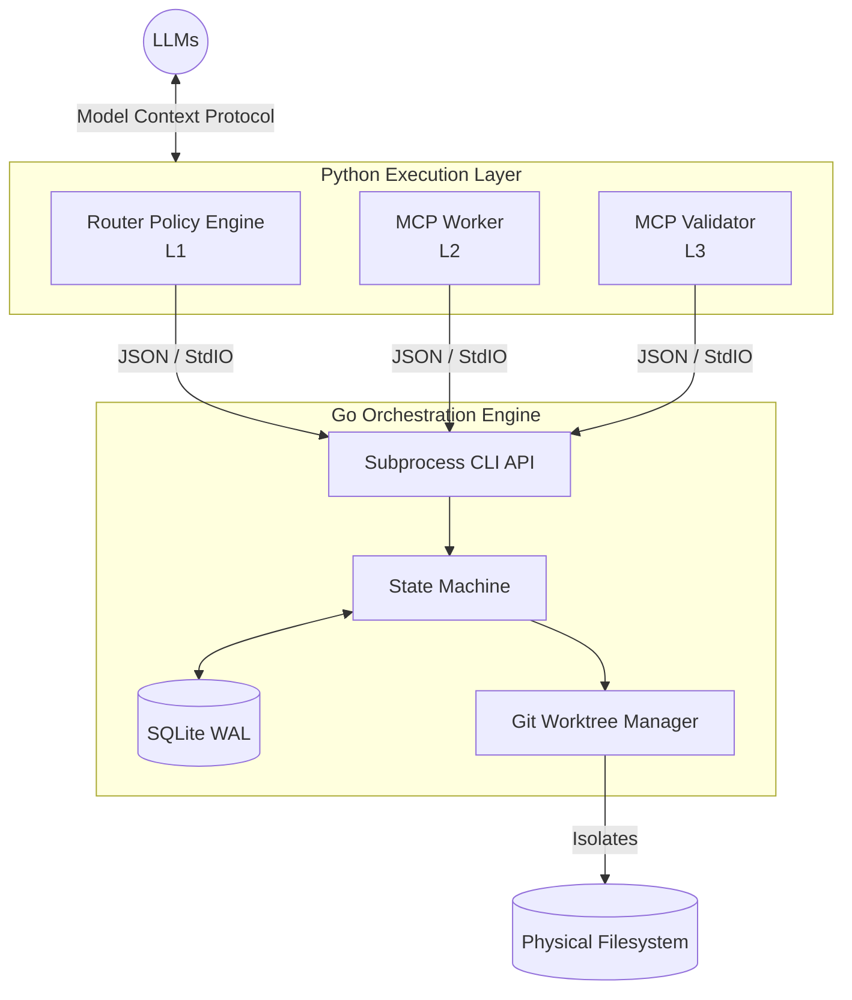

# Limen

**Limen is fundamentally a correctness-oriented workflow engine that uses LLMs as interchangeable cognitive workers.**

Limen sits between user requests and model backends, orchestrating complex, multi-agent software engineering workflows. It is not an agent framework, a distributed inference platform, or a message broker. It is a strictly controlled state machine designed to enforce code correctness before applying changes.

---

## Separation of Powers

The architecture is governed by a singular axiom:

> **Git defines feasibility, Go Core defines correctness, retrieval defines perception.**

If this separation is maintained strictly, the system stays decomposable. If any layer starts influencing another directly, the system falls into: _indistinguishable sources of truth → irreproducible behavior → impossible debugging._

---

## Core Architecture


```mermaid
flowchart TD
    subgraph PythonThinClients [Python Execution Layer]
        Router[Router Policy Engine<br/>L1]
        Worker[MCP Worker<br/>L2]
        Validator[MCP Validator<br/>L3]
    end

    subgraph GoCore [Go Orchestration Engine]
        CLI[Subprocess CLI API]
        SM[State Machine]
        DB[(SQLite WAL)]
        Git[Git Worktree Manager]
    end

    LLMs((LLMs)) <-->|Model Context Protocol| PythonThinClients

    Router -->|JSON / StdIO| CLI
    Worker -->|JSON / StdIO| CLI
    Validator -->|JSON / StdIO| CLI

    CLI --> SM
    SM <--> DB
    SM --> Git
    Git -->|Isolates| Filesystem[(Physical Filesystem)]
```

The system has pivoted from a pure-Python execution loop to a highly resilient hybrid architecture:

### 1. Go Core (State Owner)

The orchestration engine is written in Go. It is the exclusive owner of the system's state, using an **SQLite WAL (Write-Ahead Logging)** database to ensure state durability and replayability.

- **Git Worktree Virtualization**: The Go Core provisions isolated `git worktree` environments for every task, allowing LLM workers to operate concurrently without creating dirty git histories.
- **Orchestration Loop**: The Core sequentially gates tasks through a strict state machine (`CREATED` → `ROUTING_EVALUATION` → `WORKER_RUNNING` → `AWAITING_VALIDATION` → `APPROVED` → `COMMITTED`).

### 2. Thin Clients (Execution Layer)

The Python layer has no stateful responsibilities. It hosts the **stateless mock adapters** (for spike transcripts and deterministic CI runs) and the routing fallback. The real cognitive path is CLI-agnostic: the Go Core spawns coding-agent CLIs as dialect-driven subprocesses (see `docs/adr/0009`).

- **Router (L1)**: Go-native cascade over retrieval manifest confidence/coverage; decides PROCEED / EXPAND / ESCALATE per `docs/adr/0005`. Python mock adapter still available for spike transcripts.
- **Workers (L2)**: Any headless coding-agent CLI — `pi`, `claude`, `opencode`, `agy` (per-role `--worker-backend`) — generates code inside isolated worktrees. Dialects in `internal/remote/`: stream-json RPC (pi/claude/opencode) or one-shot plain text (agy).
- **Validators (L3)**: `shell` command gate (default) or an agent CLI as L3 (`--validator-backend shell|agy|claude|opencode`); evaluates the worker's artifacts against the original request.

Tool calls from the worker/validator CLI flow back to the Go Core via `limen` binary callbacks (`ready-for-review` / `submit-verdict`), which manipulate the canonical state and git; the Go Core owns state and git exclusively. See `docs/adr/0009` for the CLI-dialect + callback rationale (no MCP server).

---

## The Main Loop

The Go Core ensures absolute correctness by executing this procedural pipeline for every task:

1. **Is Git state valid?**

   └─ `no` → initiate semantic conflict resolution

2. **Build retrieval context** (ephemeral manifest)
3. **Worker produces candidate solution** (inside isolated worktree)
4. **Validator evaluates correctness**
5. **If validator fails** → trigger retry loop
6. **If Git conflict on merge** → semantic resolution step
7. **If both Git and Validator agree** → squash merge and commit via Go Core

---

## Development Status

Limen has completed its core orchestration layer. The Go Core state machine, SQLite deterministic history tracking, and the Git Worktree virtualization engine are fully implemented and robustly tested.

- [x] Formalized all capability constraints, invariants, and boundaries
- [x] Implemented the Go SQLite WAL state machine
- [x] Implemented the Go Git Worktree virtualization engine
- [x] Built the core `limen` subprocess CLI
- [x] Real Worker/Validator loop (Pi-default, MCP-fallback) reaching `COMMITTED`
- [x] Go-native progressive-retrieval pipeline (BM25 + structural stage, BM25-gated EXPAND widening)
- [x] Real Router cascade (PROCEED/EXPAND/ESCALATE per `docs/adr/0005`)
- [x] CLI-agnostic worker/validator dialects (pi, claude, opencode, agy) — `docs/adr/0009`
- [x] Interactive Bubble Tea TUI (Router/Worker/Validator/Timeline; split + tab layouts; `?` help)
- [x] Autonomous agent-driven TUI test harness (`scripts/tui-*.sh`, `tui-wait.sh`, headless CI gate)

---

## Testing Locally

The Go orchestration engine is functional and can be tested using the built CLI. The retrieval pipeline and router cascade run by default in non-mock mode; worker/validator backends are pluggable via flags.

**1. Build the CLI binary:**

```bash
go build -o bin/limen ./cmd/limen
```

**2. Run a task:**

```bash
./bin/limen run-task --task-id "test-alpha-1"
```

**3. Inspect the deterministic history:**
The orchestration state is securely written to a local SQLite database (`limen.db`).

```bash
sqlite3 limen.db
```

```sql
-- See the task's final state
SELECT id, current_state FROM tasks WHERE id = 'test-alpha-1';

-- Inspect the immutable timeline of state transitions
SELECT * FROM state_transitions WHERE task_id = 'test-alpha-1' ORDER BY recorded_at ASC;

-- Inspect the tool invocations
SELECT * FROM tool_calls WHERE task_id = 'test-alpha-1';
```

### Interactive TUI

The bare invocation launches the observe-only Bubble Tea TUI (Router/Worker/Validator/Timeline), running the orchestrator in-process with the L1/L2/L3 components spawned as subprocesses. Non-TTY stdout falls back to the one-shot log-style output above.

```bash
./bin/limen --task-id "test-alpha-1" --prompt "Fix the add function" \
  --repo-path ./tmp/test-repo --mock=true --coverage-floor=0 --confidence-floor=0
```

Keys: `1`-`4` / `[` `]` switch tabs (tab layout, <120×30); `w`/`Enter`/`Esc` navigate workers (split layout, ≥120×30); `j`/`k` scroll; `?` help; `q` quit.

### Autonomous test harness

`scripts/tui-*.sh` drive the TUI in a tmux session so an agent can test it with no human in the loop — start, wait for a terminal state, capture, navigate, and quit cleanly:

```bash
./scripts/reset-test-repo.sh tmp/test-repo
./scripts/tui-start.sh limen-tui --task-id tui-1 --prompt "Fix the add function" \
  --repo-path tmp/test-repo --mock=true --coverage-floor=0 --confidence-floor=0
./scripts/tui-wait.sh limen-tui --timeout 600   # exit 0 on COMMITTED|FAILED_ESCALATED|FINALIZED, 124 on timeout
./scripts/tui-capture.sh limen-tui               # assert on rendered text
./scripts/tui-send.sh limen-tui "q" && ./scripts/tui-stop.sh limen-tui
```

`scripts/test-tui-e2e.sh` runs the deterministic mock lifecycle headlessly (no tmux, no tokens) and is wired as the `.github/workflows/tui-e2e.yml` CI gate. See `.agents/skills/limen-tui/SKILL.md` and `docs/spikes/016-autonomous-tui-testing.md`.
